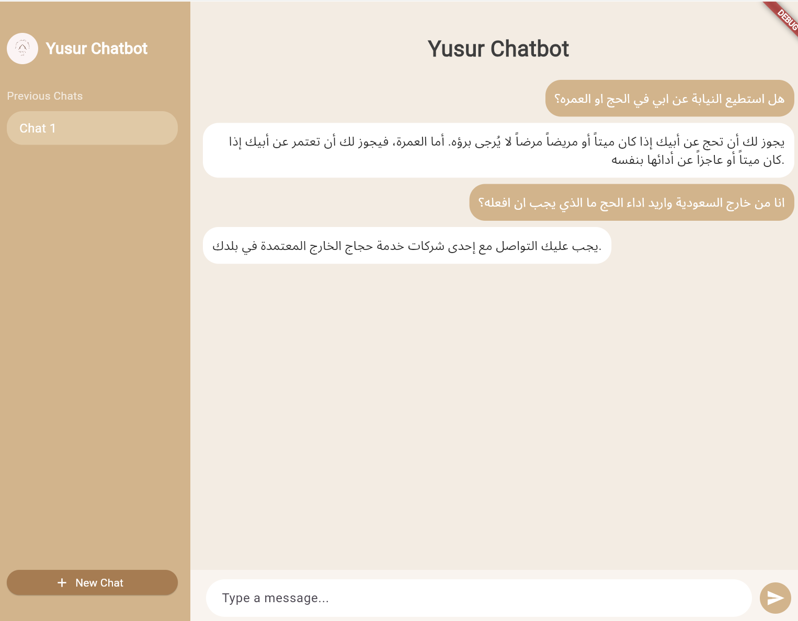
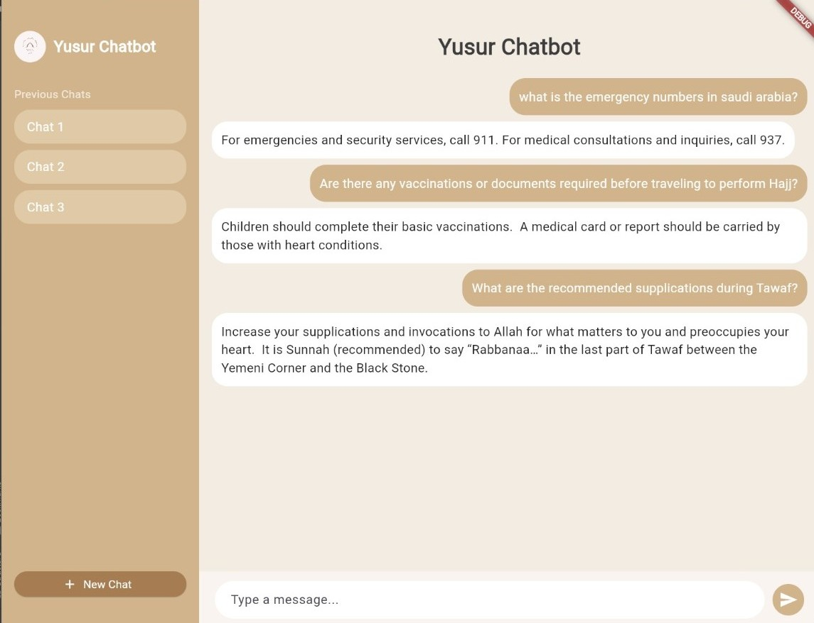

# Yusur: RAG Based Hajj and Umrah Chatbot (يـُــســــر)

## 📌 Overview
**Yusur** is a bilingual (Arabic and English) AI-powered chatbot designed to support millions of Hajj and Umrah pilgrims by offering real-time, accurate, and trusted guidance. This project contributes to Saudi Arabia's Vision 2030 by enhancing accessibility to religious, healthcare, legal, and cultural information using Large Language Models and Retrieval-Augmented Generation (RAG) technology.

---

## 🎯 Motivation
Pilgrims often face challenges such as:
- Overcrowding and language barriers
- Limited access to reliable religious or medical information
- Unresponsive or slow existing tools 

**Yusur bridges this gap** by combining speed **and** reliability in a single AI tool tailored to the Hajj and Umrah context.

---

## 🚀 Features
- 🔍 **Retrieval-Augmented Generation (RAG)** pipeline for relevant, trustworthy answers
- 🌐 **Bilingual support** (Arabic and English)
- 💬 **Real-time responses** (as fast as 0.88s using Gemini)
- ⚕️ **Healthcare guidance** tailored to symptoms
- 📖 **Islamic historical and cultural content**
- 📱 **Multi-platform accessibility** (design-ready)

---

## 🛠️ Technical Details
- **LLMs Used**: GPT-4, Gemini, ALLAM
- **RAG Architecture**:
  - Dense retrieval using various embedding models
  - Contextual compression for precision
- **Evaluation Methods**:
  - ✅ **Subjective (Expert Evaluation)**: Avg. 97.2% trust
  - 📊 **RAGAs (Automated)**: Gemini scored 85%
  - 🕐 **Response Time**: Gemini achieved 0.88s (fastest)

---

## 📊 Results Summary

| Evaluation Metric     | GPT-4 | ALLAM | Gemini |
|-----------------------|-------|-------|--------|
| Answer Relevancy      | 83%   | **91%** | 89%    |
| Faithfulness          | 84%   | 80%   | **90%** |
| Response Time (sec)   | 2.3   | 1.6   | **0.88** |

---

## 🔍 Use Case
Pilgrims can ask questions like:
- "What are the steps of Umrah?"
- "What should I do if I feel dizzy during Hajj?"
- "Tell me about the significance of Mina."

Yusur provides personalized, grounded answers with sources from trusted religious and medical domains.

---

## 📈 Impact
- Supports Saudi Vision 2030 by digitizing religious services
- Promotes inclusion through Arabic-English bilingualism
- Offers a scalable solution for millions of pilgrims worldwide

---

## 📷 Screenshots

### Arabic Version

### English Version

## 🧠 Future Work
- Expand support to additional languages and dialects
- Integrate voice-based interface for hands-free access
- Deploy chatbot on real-time platforms such as WhatsApp or web portals

